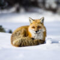

# Description
NOTE: Although the IDE I used was Processing, the language I used to program the algorithm was Java, just using Processing's built in graphics commands

# Image Examples
Original Images are on the left and Minecraft Versions are on the right
##### Fox Sitting in Snow
 
##### Camera Icon
 

# How It Works (WIP)
### Average Block Color
### Color Matching
### Dithering
